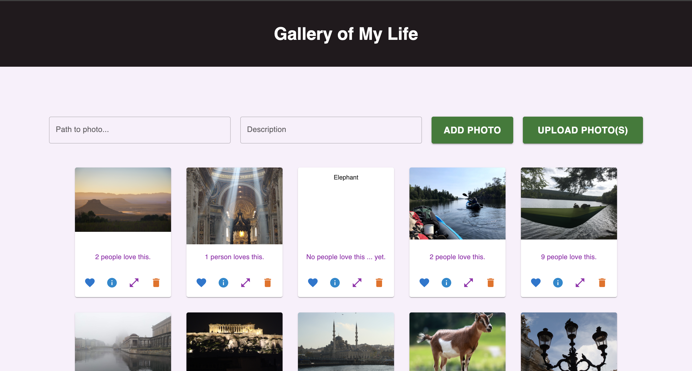
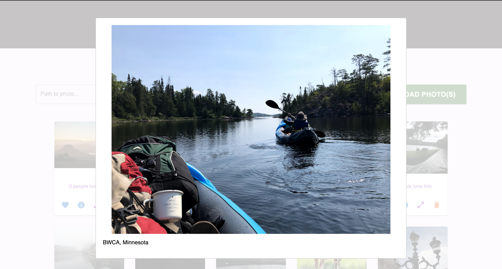
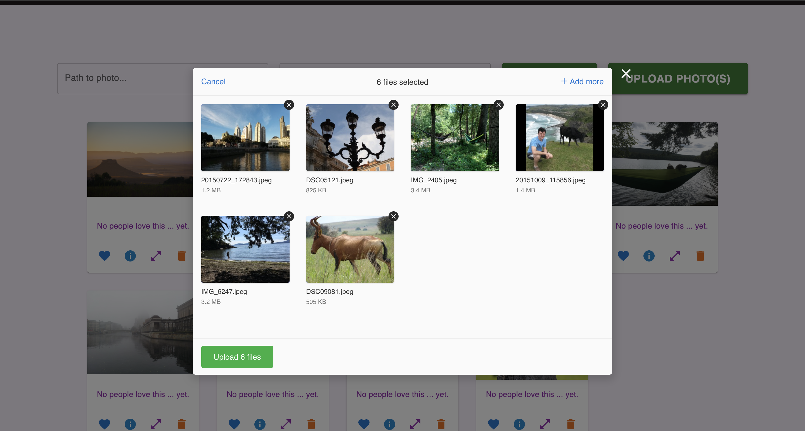
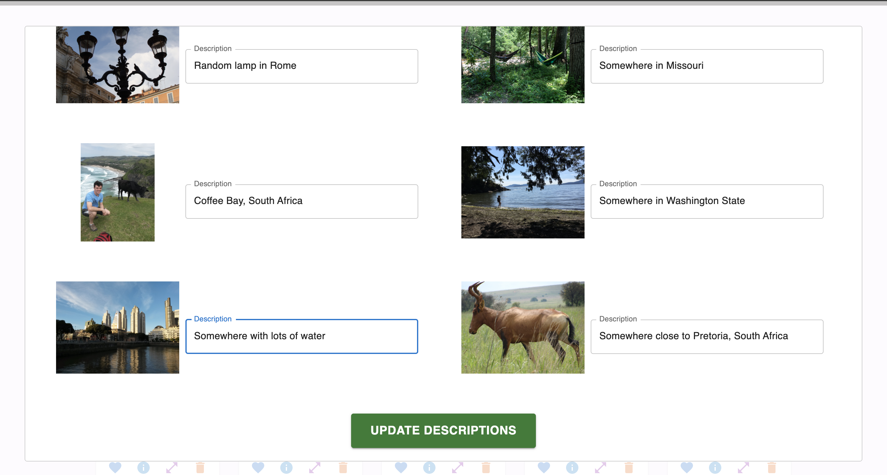

# React - Gallery of My Life

## Description

_Duration: Weekend Challenge_

This app is a gallery of photos. Photos are displayed in a grid pattern on cards, and the user can interact with the photos in several ways. Users can "love" photos (with each successive click, the "love" counter goes up - conditional rendering will show either "1 person loves" or "x people love" this). By clicking on the info button, the photo's description is displayed on the card rather than the card itself. clicking the expand button on the card will bring up a modal with a larger resolution image of the picture, accompanied by its description as a caption. Finally, clicking the delete icon will remove the reference to this image from the database.

The app allows users to upload photos either by supplying a URL or description, or performing a batch upload of photos from their computer through a modal interface. Batch uploading photos will transfer the photos from the user's computer to the app's server, after which the user will be prompted to supply a description for each newly uploaded image. Users may choose to leave descriptions blank.

The upload modal is an implementation of [uppy](https://uppy.io/), while other modals make use of [react-modal](https://www.npmjs.com/package/react-modal). Most of the styling was done using [Material-UI](https://mui.com/).

## Screenshots

_Gallery with middle top card displaying image information._

_Expanded image._

_Batch image upload._

_Updating descriptions after batch image upload._

## Prerequisites

- [Node.js](https://nodejs.org/en/)
- [PostgreSQL](https://www.postgresql.org/)

## Installation

1. After cloning this repository, set up a PostgreSQL database called `react_gallery` on port 5432. You might want to use [Postico](https://eggerapps.at/postico/) as a GUI to help this setup process.
2. Use the commands in the `database.sql` file in the root directory of the project to set up a table in the database with some dummy data.
3. Run `npm install` to install dependencies in this project.
4. Run `npm server start` to start the server, which will run on port 5000.
5. Run `npm client start` to start the client, which will run on port 3000.
6. Running the client should open up a browser window to `localhost:3000` where you can view and use the app. You can also manually type in this address in your browser.

## Usage

1. There are two ways to upload photos to the gallery. The first is to manually type or copy in a path to an image (this can be a url to an image anywhere on the internet) in the "Path to photo" input. An optional description for this image can be typed into the description box. To upload the photo, click on the "Add Photo" button. The photo will appear as the last entry in the photo gallery.
2. To upload images from files on your computer, you can select the "Upload Photo(s)" button. This will open a box into which you can either drag and drop the files you want to upload, or select "browse files" to select files through your computer's file manager. Click on the "Upload" button to indicate you are done.
3. When uploading files from your computer, you will be given a chance to type in a description for each photo. When complete, either click on "Update Descriptions" or simply click outside of the modal.
4. To "love" the photo, click on the heart icon of the photo in question.
5. To see a description of the photo (entered by the user, of course), click on the info icon.
6. To view a larger version of the photo, click on the expand icon.
7. To remove this photo from the gallery, click on the delete button.

## Built With

1. [Node.js](https://nodejs.org/en/)
2. [Express](https://expressjs.com/)
3. [React](https://reactjs.org/)
4. [PostgreSQL](https://www.postgresql.org/)
5. [Material-UI](https://mui.com/)
6. [uppy](https://uppy.io/)
7. [react-modal](https://www.npmjs.com/package/react-modal)
8. [express-fileupload](https://www.npmjs.com/package/express-fileupload)
9. [axios](https://www.npmjs.com/package/axios)
10. HTML
11. CSS

## Acknowledgement

Thanks to [Prime Digital Academy](www.primeacademy.io) who equipped and helped me to make this application a reality.
